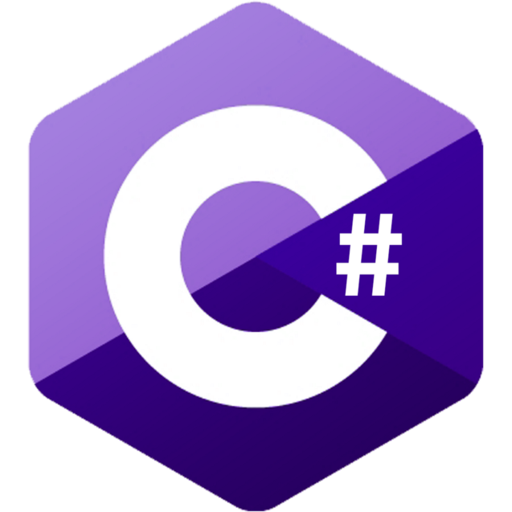

# **Hi Programmers** 🙏

I'm _Daniel_, I present myself on social sites as _ton1czech_ and I live in **Czech republic**. I'm mostly focused on **Python** and **React**.

---

 

## 💭 **ABOUT ME**

- 🇨🇿 I am **17 years old** student from **Czech republic**
- ♈ I am **Aries**
- 💻 I love **programming**
- 💪 I do **calisthenics**
- 🌑 I like **fantasy** books and movies
- 🖥 I also like to play **video games**

---

 

## 💫 **SOCIAL SITES**

---

 

## 🔥 **SKILLS**

-  **Python**
-  **HTML**
-  **CSS**
-  **JavaScript**
-  **React**
-  **C++**
-  **C#**
-  **Golang**

 

